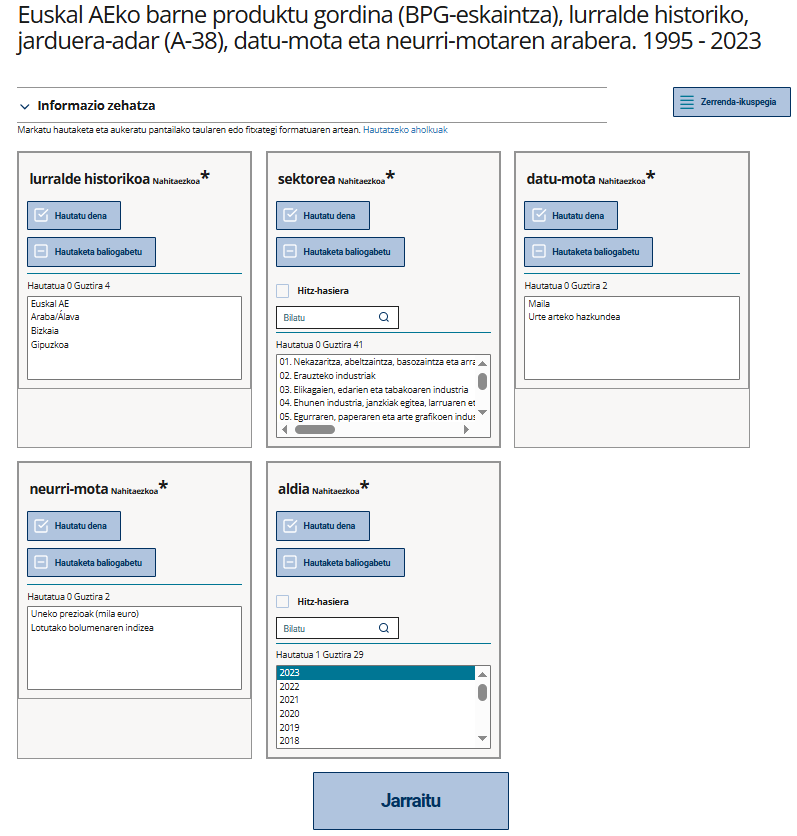

# 1. Sarrera

Eustatek 2.000 taula baino gehiago biltzen dituen bere [Datu Bankua](https://eu.eustat.eus/banku/indexArbol.html) kontsultatzeko API bat du martxan. 

API honek datu estatistiko eguneratuak programazio bidez eskuratzeko aukera ematen du, web bidezko deskargaren alternatiba automatizatu gisa. API honi esker, posible da:

 - datuak beti eguneratuta bistaratzea, adibidez web orri batean taula edo grafiko moduan
 - datuak zuzenean R, Python edo Jupyter Notebooks bezalako tresnetara inportatzea, ondoren tratatzeko eta aztertzeko

APIek (Aplikazioen Programazio Interfazeek) sistema desberdinen arteko komunikazioa ahalbidetzen dute. APIra egindako eskaera batek hiru elementu nagusi izaten ditu:

 - web helbide nagusia (endpoint)
 - deia egiteko funtzio bat, HTTP metodo baten bidez (`GET`, `POST`, etab.)
 - datuak filtratzeko, ordenatzeko edo pertsonalizatzeko aukera ematen duten parametro multzoa

Eustaten APIaren URL helbideen (endpointen) oinarrizko egitura honako hau da:


URLaren segmentu bakoitzak funtzio bat du:

- <span style="color:blue">🔵 `www.eustat.eus/bankupx/api`: Zerbitzuaren helbidearen zati finkoa. 
- <span style="color:purple">🟣 `v1`: APIaren bertsioa (balio finkoa). 
- <span style="color:orange">🟠 `hizkuntza`: Nahitaezkoa. Euskera `eu`, gaztelania `es` edo ingelesa `en` izan daiteke.
- <span style="color:goldenrod">🟡 `DB`: Eustaten Datu Bankurako sarbidea adierazten du (balio finkoa). 
- <span style="color:green">🟢 `id`: Aukerakoa. Kontsultatu beharreko dataset edo taularen identifikazio-kodea (adibidez, PX_010154_cepv1_ep19.px)

Jarraian, APIko sarrerako puntuetara deitzeko modua zehazten da, baita datuak kontsultatzeko behar diren metodoak eta parametroak ere.

# 2. Datu-bankuko taulen zerrenda

 Datu-bankuaren URLra deitzen baduzu `GET` funtzioarekin, taula guztien zerrenda agertuko zaizu JSON formatuan. Datu bankuaren URL helbideak egitura hau du:

`https://www.eustat.eus/bankupx/api/v1/{hizkuntza}/DB`

`{hizkuntza}` parametroa zehaztu behar da. `eu` jarriz gero, taulen zerrenda euskeraz azalduko zaizu:

👉 https://www.eustat.eus/bankupx/api/v1/eu/DB

Erantzunaren itxura:

```json
{
    "id": "PX__fe_inem06.px",
    "type": "t",
    "text": "Euskal AEko erregistratutako langabezia, lurralde eremuaren eta sexuaren arabera. 1997 - 2022",
    "updated": "2023-01-09T15:04:41"
  },
  {
    "id": "PX__feinem_inem06.px",
    "type": "t",
    "text": "Euskal AEko erregistratutako langabezia, lurralde eremuaren eta sexuaren arabera",
    "updated": "2021-02-17T10:04:22"
  }
```

JSON formatuan azaltzen den erantzunak atributu hauek dakartza:

| Atributua | Deskribapena                                                                                          |
|-----------|-------------------------------------------------------------------------------------------------------|
| `id`      | Taularen kode identifikatzailea                                                                       |
| `type`    | `t` = Taula                                                                                           |
| `text`    | Taularen izenburua (edukiaren deskribapena)                                          |
| `updated` | Taula azken aldiz eguneratu den eguna eta ordua


# 3. Taula baten metadatuak

Taula baten URLari `GET` funtzioarekin dei eginez gero, taulako metadatuak itzuliko dizkizu JSON formatuan. Taularen identifikazio kodea ezagutzen baduzu, URLa kontsulta dezakezu parametro hauekin:

`https://www.eustat.eus/bankupx/api/v1/{hizkuntza}/DB/[id]`

`{hizkuntza}` parametroa hizkuntzari dagokio. `[id]` parametroa taularen kode identifikatzaileari dagokio.

Metadatuek izenburu bat dute ("title") hasieran eta ondoren taulan azaltzen diren aldagaien zerrenda.

Adibidez:

👉 https://www.eustat.eus/bankupx/api/v1/eu/DB/PX_050403_cpra_tab_a_25.px

Erantzunaren itxura:

```json
{
  "title": "Euskal AEko 16 urte eta gehiagoko biztanleria landunaren asteko orduen batez bestekoa, lurralde, sexu, sektore ekonomiko eta hiruhilekoaren arabera (orduak). 2015 - 2025",
  "variables": [
    {
      "code": "territorio histórico",
      "text": "lurralde historikoa",
      "values": [
        "_T",
        "01",
        "48",
        "20"
      ],
      "valueTexts": [
        "Euskal AE",
        "Araba/Álava",
        "Bizkaia",
        "Gipuzkoa"
      ]
    },
    {
      "code": "sexo",
      "text": "sexua",
      "values": [
        "_T",
        "1",
        "2"
      ],
      "valueTexts": [
        "Guztira",
        "Gizona",
        "Emakumea"
      ]
    },
    {
      "code": "sector económico",
      "text": "sektore ekonomikoa",
      "values": [
        "_T",
        "01",
        "02",
        "03",
        "04"
      ],
      "valueTexts": [
        "Guztira",
        "Nekazaritza, abeltzaintza, basozaintza eta arrantza",
        "Industria",
        "Eraikuntza",
        "Zerbitzuak"
      ]
    },
    {
      "code": "trimestre",
      "text": "hiruhilekoa",
      "values": [
        "10",
        "20",
        "30",
        "40",
        "50"
      ],
      "valueTexts": [
        "Urteko batez bestekoa",
        "1. Hiruhilekoa",
        "2. Hiruhilekoa",
        "3. Hiruhilekoa",
        "4. Hiruhilekoa"
      ]
    },
    {
      "code": "periodo",
      "text": "aldia",
      "values": [
        "2015",
        "2016",
        "2017",
        "2018",
        "2019",
        "2020",
        "2021",
        "2022",
        "2023",
        "2024",
        "2025"
      ],
      "valueTexts": [
        "2015",
        "2016",
        "2017",
        "2018",
        "2019",
        "2020",
        "2021",
        "2022",
        "2023",
        "2024",
        "2025"
      ],
      "time": true
    }
  ]
```

"Variables" objetuek lau atributu dituzte:

| Atributua    | Deskribapena                                           |
|-------------|------------------------------------------------------|
| `code`      | Aldagaiaren kodea                                    |
| `text`      | Aldagaiaren izena                                    |
| `values`    | Aldagaiaren balioen zerrenda, kodeekin               |
| `valueTexts`| Aldagaiaren balioen zerrenda, testuekin              |


# 4. Taula bateko datuak

Taula bateko datuak lortzeko, kontsulta bat egin behar diozu (JSON formatuan) interesatzen zaizun taularen URLari. Metadatuak lortzeko erabiltzen den sarbide-puntu bera da, baina oraingoan `POST` funtzioa erabiltzen da.

Kontsulta guztiak honako testu honekin hasten dira:  `{query: [{...}]}`. Filtro hauek erabiltzen dira:

| Filtroa | Deskribapena                                                                |
|--------|------------------------------------------------------------------------------|
| `item` | Filtratu nahi diren balioen hautaketa                                                             |
| `top`  | Lortu nahi diren azken "x" balioen kopurua hautatzeko. Normalean, aldia/urtea aldagaiarekin erabiltzen da |

Adibidez:

```json
{
  "query": [
    {
      "code": "componente",
      "selection": {
        "filter": "item",     // ← "componente" izeneko aldagaiaren filtroa
        "values": [
          "200"               // ← aukeratutako balioa
        ]
      }
    },
    {
      "code": "tipo de serie",
      "selection": {
        "filter": "item",     // ←  "tipo de serie" izeneko aldagaiaren filtroa
        "values": [
          "10",               // ← aukeratutako balioak
          "30"
        ]
      }
    },
    {
      "code": "periodo",
      "selection": {
        "filter": "top",      // ←  "top" filtroa, "periodo" izeneko aldagaiaren azken "x" baloreak lortzeko
        "values": [5]         // ← azken 5 baloreak eskatzen dira
      }
    }
  ],
  "response": {
    "format": "json-stat"     // ← irteerako formatua (json-stat dago lehenetsia)
  }
}
```
Kontsulta hau egin ahal izateko, taulak zer aldagai eta balio dituen jakin behar da. Taula bakoitzaren aldagai eta balioen informazioa bi modutara lor daiteke:

- Metadatuak kontsultatuz, 3 atalean adierazten den bezala **3. Taula baten metadatuak**.
- Datu-bankuko aldagaiak eta balioak hautatzeko laguntzailea (erabiltzailearen interfazea) erabiliz. Taula jakin baten hautaketa-laguntzailearen URL helbideak egitura hau du:

`https://www.eustat.eus/bankupx/pxweb/{hizkuntza}/DB/-/{id}`

Adibidez: 👉 https://www.eustat.eus/bankupx/pxweb/eu/DB/-/PX_170112_cpib_pib_a_01.px

Taula guztien zerrenda helbide honetan kontsulta daiteke  👉 https://www.eustat.eus/bankupx/pxweb/eu/DB/-/

Jarraian, hautaketa-laguntzailea erabiliz POST kontsulta bat egiteko urratsak azalduko ditugu:


### Nola hautatu aldagaiak eta balioak

Balio konkretu batzuk aukeratu nahi ditugu honako taula honetan: "Euskal AEko barne produktu gordina (BPG-eskaintza), lurralde historiko, jarduera-adar (A-38), datu-mota eta neurri-motaren arabera. 1995 - 2023".

Taula helbide honetan dago: https://eu.eustat.eus/bankupx/pxweb/eu/DB/-/PX_170112_cpib_pib_a_01.px



Egin klik **Taula hau eskuragarri egin zure aplikazioan** atalean. Hor azalduko dira APIaren bidez datuak lortzeko beharrezkoak diren URLa eta kontsulta.


Interfazeak APIan erabiliko den kodea sortzen eta editatzen laguntzen dio erabiltzaileari. Kontsulten kodea sortzeko pentsatuta dago, eta ez produkzioan erabiltzeko.

Irteerako JSON fitxategiak irakurtzeko, formatu hori prozesatu dezakeen programa edo lengoaia bat erabili behar da. Tutorialak eta kode-adibideak sortu ditugu erabiltzaileei Eustaten APIaren erabilera errazteko [**R lengoaian**](../code_examples/eu/tutorial_R_eu.Rmd), [**Pythonen**](../code_examples/eu/tutorial_Python_eu.ipynb) eta [**Javascript-en**](https://uxue-sudupe.github.io/API-Eustat/code_examples/eu/tutorial_highcharts_eu.html) 


### Irteera-formatuak

APIak 5 formatutan itzul ditzake tauletako datuak:

- **JSON-stat**, 1.2 bertsioa (formatu lehenetsia)
- **CSV** (testu laua)
- **CSV2** (formatu egokiena taula dinamikoekin lan egiteko)
- **CSV3** (CSV2 bezala, baina kodeekin testuaren ordez)
- **XLSX** (Excel)

Datuak erraz eta modu malguan prozesatzeko, JSON-stat formatua gomendatzen dugu.

