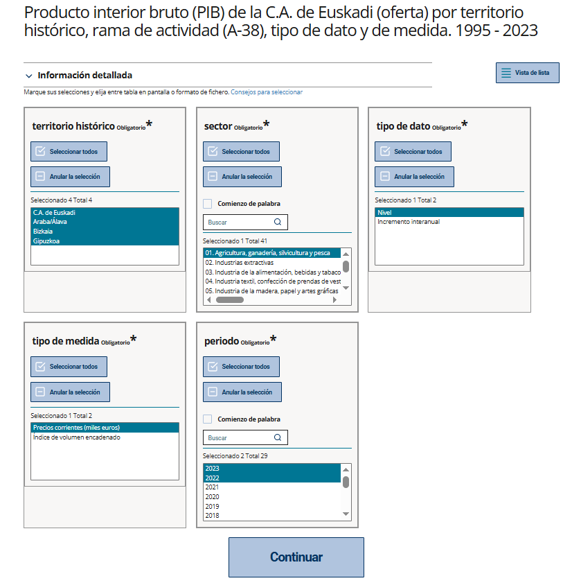
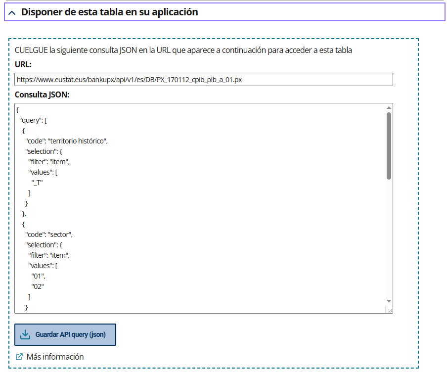

# 1. Introducción

Eustat ofrece una API para consultas a las más de 2.000 tablas de su [Banco de Datos](https://www.eustat.eus/banku/indexArbol.html).

El objetivo principal de esta API es ofrecer acceso en tiempo real a los datos estadísticos, facilitando su integración en distintos entornos de análisis o visualización. Los datos obtenidos pueden:

- Visualizarse como tablas o gráficos en páginas web.
- Importarse a herramientas como R, Python o Jupyter Notebooks para su posterior procesamiento y análisis.

Esta API utiliza los métodos http **POST** y **GET**:

- `GET` se usa para obtener un listado de las tablas del banco de datos. También devuelve los metadatos, en el caso de consultar una tabla concreta.
- Para obtener datos, debes usar la función `POST` y formular una consulta en **JSON** (Notación de Objetos JavaScript). Puedes obtener la tabla completa o partes de ella.

A continuación se detalla cada uno de los puntos de acceso (endpoints) de la API.


# 2. Listado de tablas del banco de datos

Si usas la función GET sobre la url del banco de datos, se muestra el listado de todas las tablas en formato JSON. La dirección url del banco de datos tiene la siguiente estructura: 

`https://www.eustat.eus/bankupx/api/v1/{lang}/DB`

El campo {lang} corresponde al idioma. Es obligatorio y puede tomar los siguientes valores: ES: español / EU: euskera / EN: inglés.

Listado de tablas en español:

👉 [https://www.eustat.eus/bankupx/api/v1/es/DB](https://www.eustat.eus/bankupx/api/v1/es/DB)

Aspecto de la respuesta:

```json
[
  {
    "id": "PX__fe_inem06.px",
    "type": "t",
    "text": "Paro registrado de la C.A. de Euskadi por ámbitos territoriales y sexo. 1997 - 2022",
    "updated": "2023-01-09T15:04:41"
  },
  {
    "id": "PX__feinem_inem06.px",
    "type": "t",
    "text": "Paro registrado de la C.A. de Euskadi por ámbitos territoriales y sexo",
    "updated": "2021-02-17T10:04:22"
  }
]
```

El texto JSON que se muestra contiene los siguientes campos:

| Campo     | Descripción                                                                                           |
|-----------|-------------------------------------------------------------------------------------------------------|
| `id`      | Código identificador de la tabla                                                                      |
| `type`    | `t` = Tabla                                                                                           |
| `text`    | Título de la tabla (descripción del contenido + intervalo de tiempo)                                  |
| `updated` | Fecha de última actualización de la tabla    


# 3. Metadatos de una tabla

La función GET sobre la URL de una tabla devolverá los metadatos de la tabla en formato JSON. Si conoces el código identificador de la tabla en el banco de datos, puedes usar la URL con estos parámetros:

`https://www.eustat.eus/bankupx/api/v1/{lang}/DB/[id]`

El campo {lang} corresponde al idioma, y el campo [id] corresponde al identificador de la tabla con los datos o metadatos de interés.

Los metadatos constan de un título ("title") y una lista de variables para la tabla.

Ejemplo:

👉(https://www.eustat.eus/bankupx/api/v1/es/DB/PX_050403_cpra_tab_a_25.px)

Aspecto de la respuesta:

```json
 "title": "Media de horas semanales trabajadas por la población ocupada de 16 y más años de la C.A. de Euskadi por, territorio histórico, sexo, sector económico y trimestre (horas). 2015 - 2025",
  "variables": [
    {
      "code": "territorio histórico",
      "text": "territorio histórico",
      "values": [
        "_T",
        "01",
        "48",
        "20"
      ],
      "valueTexts": [
        "C.A. de Euskadi",
        "Araba/Álava",
        "Bizkaia",
        "Gipuzkoa"
      ]
    },
    {
      "code": "sexo",
      "text": "sexo",
      "values": [
        "_T",
        "1",
        "2"
      ],
      "valueTexts": [
        "Total",
        "Hombre",
        "Mujer"
      ]
    },
    {
      "code": "sector económico",
      "text": "sector económico",
      "values": [
        "_T",
        "01",
        "02",
        "03",
        "04"
      ],
      "valueTexts": [
        "Total",
        "Agricultura, ganadería, silvicultura y pesca",
        "Industrias ",
        "Construcción",
        "Servicios"
      ]
    },
    {
      "code": "trimestre",
      "text": "trimestre",
      "values": [
        "10",
        "20",
        "30",
        "40",
        "50"
      ],
      "valueTexts": [
        "Promedio anual",
        "Trimestre 1",
        "Trimestre 2",
        "Trimestre 3",
        "Trimestre 4"
      ]
    },
    {
      "code": "periodo",
      "text": "periodo",
      "values": [
        "2015",
        "2016",
        "2017",
        "2018",
        "2019",
        "2020",
        "2021",
        "2022",
        "2023",
        "2024",
        "2025"
      ],
      "valueTexts": [
        "2015",
        "2016",
        "2017",
        "2018",
        "2019",
        "2020",
        "2021",
        "2022",
        "2023",
        "2024",
        "2025"
      ],
      "time": true
    }
  ]
```

 Los objetos "variables" tienen cuatro atributos:

| Campo       | Descripción                                                |
|-------------|------------------------------------------------------------|
| `code`      | Código de la variable                                      |
| `text`      | Nombre de la variable                                      |
| `values`    | Listado de valores de la variable, en código               |
| `valueTexts`| Listado de valores de la variable, en texto                |


# 4. Datos de una tabla

Para obtener los datos de una tabla, debes formular una consulta en formato JSON a la url de la tabla de interés. Es el mismo punto de acceso que se utiliza para obtener los metadatos, pero esta vez se utiliza la función `POST`.

Todas las consultas comienzan con el objeto: `{query: [{...}]}`. Los filtros que se utilizan son estos:

| Filtro | Descripción                                                                 |
|--------|------------------------------------------------------------------------------|
| `item` | Selección de los valores individuales que se quieren filtrar                |
| `top`  | Selección del número de los últimos valores que se quieren obtener. Se usa normalmente con la variable periodo/año |

Por ejemplo:

```json
{
  "query": [
    {
      "code": "componente",
      "selection": {
        "filter": "item",     // ← filtro de la variable "componente"
        "values": [
          "200"               // ← valor seleccionado
        ]
      }
    },
    {
      "code": "tipo de serie",
      "selection": {
        "filter": "item",     // ← filtro de la variable "tipo de serie"
        "values": [
          "10",               // ← valores seleccionados
          "30"
        ]
      }
    },
    {
      "code": "periodo",
      "selection": {
        "filter": "top",      // ← filtro "top", últimos X valores de la variable "periodo"
        "values": [5]         // ← se seleccionan los 5 últimos valores
      }
    }
  ],
  "response": {
    "format": "json-stat"     // ← formato de salida (json-stat por defecto)
  }
}
```
Para realizar esta consulta es necesario conocer qué variables y valores contiene la tabla. Esta información se puede obtener de dos formas:

- Consultando los metadatos, como se indica en el apartado **3. Metadatos de una tabla**.
- Utilizando el asistente para la selección de variables y valores (interfaz de usuario) del banco de datos. La dirección url del asistente de una tabla tiene la siguiente estructura:

`https://www.eustat.eus/bankupx/pxweb/{lang}/DB/-/{id}`

A continuación, se muestran los pasos necesarios para configurar la consulta POST utilizando el asistente:

### Ejemplo de selección de variables y valores

Queremos seleccionar algunos valores concretos de la tabla "Producto interior bruto (PIB) de la C.A. de Euskadi (oferta) por territorio histórico, rama de actividad (A-38), tipo de dato y de medida. 1995 - 2023" que se encuentra en la dirección https://es.eustat.eus/bankupx/pxweb/es/DB/-/PX_170112_cpib_pib_a_01.px.



Haz clic en el apartado **“Disponer de esta tabla en su aplicación”**. Esto mostrará la URL y la consulta necesarias para obtener los datos mediante la API.



La interfaz ayuda al usuario a generar y editar el código que se utilizará en la API. Está pensada para generar el código de las consultas y no para su uso en producción.

Para leer los archivos JSON de salida de las solicitudes de datos descritas en esta página, debe utilizarse un programa o lenguaje de programación que permita procesar este formato. Se han elaborado tutoriales y ejemplos de código en  [**R**](../code_examples/tutorial_R_es.Rmd), [**Python**](../code_examples/tutorial_Python_es.ipynb) y [**JavaScript**](../code_examples/tutorial_highcharts_es.md) para facilitar a los usuarios el uso de la API de Eustat.

### Formatos de salida

La API puede devolver resultados en 6 formatos diferentes:

- **JSON-stat**, versión 2 *(formato predeterminado)*
- **CSV** (formato plano)
- **CSV2** (formato compatible con tablas dinámicas)
- **CSV3** (igual que CSV2, pero con códigos en lugar de texto)
- **XLSX** (Excel)
- **JSON-stat**, versión 1.2

Para un tratamiento flexible de los datos, recomendamos JSON-stat, que es la salida por defecto.
