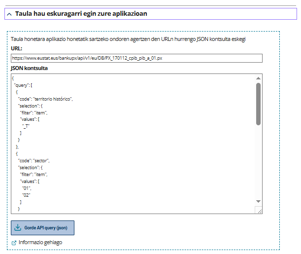

# 1. Sarrera

Eustatek 2.000 taula baino gehiago biltzen dituen bere [Datu Bankua](https://eu.eustat.eus/banku/indexArbol.html) kontsultatzeko API bat du martxan. 

APIaren helburu nagusia denbora errealean datu estatistikoetarako sarbidea eskaintzea da, berrerabili ahal izateko. Datu horiek analisi edo bistaratze ingurune desberdinetan integratu daiteze erraz, honakoa egiteko, adibidez:

- Web orrietan taula edo grafiko gisa bistaratu, denbora errealean.
- R, Python edo Jupyter Notebooks bezalako tresnetara inportatu, ondoren prozesatu eta aztertzeko.

API honek http **POST** eta **GET** metodoak erabiltzen ditu:

- Datu-bankuko taulen zerrenda bat lortzeko erabiltzen da GET. Metadatuak ere itzultzen ditu, taula zehatz bat kontsultatuz gero.
- Datuak lortzeko, "POST" funtzioa erabili eta kontsulta bat egin behar da **JSON** (JavaScript Objektuen Notazioa) formatuan. Taula osoa edo haren zatiak eskura ditzakezu.

Jarraian, APIaren sarbide-puntu bakoitza (endpointak) eta kontsulta metodoak zehazten da.


# 2. Datu-bankuko taulen zerrenda

GET funtzioa datu-bankuaren url gainean erabiltzen baduzu, taula guztien zerrenda agertuko zaizu JSON formatuan. Datu-bankuaren URL helbideak egitura hau du:

`https://www.eustat.eus/bankupx/api/v1/{lang}/DB`

`{lang}` parametroa hizkuntzari dagokio. Nahitaezkoa da eta balio hauek har ditzake: EU: euskara / ES: gaztelania / EN: ingelesa.

Taulen zerrenda euskeraz:

[https://www.eustat.eus/bankupx/api/v1/eu/DB] (https://www.eustat.eus/bankupx/api/v1/eu/DB)

Erantzunaren itxura:

```json
{
    "id": "PX__fe_inem06.px",
    "type": "t",
    "text": "Euskal AEko erregistratutako langabezia, lurralde eremuaren eta sexuaren arabera. 1997 - 2022",
    "updated": "2023-01-09T15:04:41"
  },
  {
    "id": "PX__feinem_inem06.px",
    "type": "t",
    "text": "Euskal AEko erregistratutako langabezia, lurralde eremuaren eta sexuaren arabera",
    "updated": "2021-02-17T10:04:22"
  }
```

JSON formatuan azaltzen den erantzunak atributu hauek dakartza:

| Campo     | Deskribapena                                                                                          |
|-----------|-------------------------------------------------------------------------------------------------------|
| `id`      | Taularen kode identifikatzailea                                                                       |
| `type`    | `t` = Taula                                                                                           |
| `text`    | Taularen izenburua (edukiaren deskribapena + denbora-tartea)                                          |
| `updated` | Taula azken aldiz eguneratu den eguna    


# 3. Taula baten metadatuak

Taula baten URLaren gainean eginez gero, GET funtzioak taulako metadatuak itzuliko ditu JSON formatuan. Taularen identifikazio kodea ezagutzen baduzu, URLa kontsulta dezakezu parametro hauekin:

`https://www.eustat.eus/bankupx/api/v1/{lang}/DB/[id]`

`{lang}` eremua hizkuntzari dagokio, eta `[id]` eremua taularen identifikatzaileari dagokio, interesatzen zaizun datu edo metadatuekin.

Metadatuek izenburu bat dute ("title") eta taulako aldagai zerrenda bat.

Adibidea:

👉(https://www.eustat.eus/bankupx/api/v1/eu/DB/PX_050403_cpra_tab_a_25.px)

Erantzunaren itxura:

```json
{
  "title": "Euskal AEko 16 urte eta gehiagoko biztanleria landunaren asteko orduen batez bestekoa, lurralde, sexu, sektore ekonomiko eta hiruhilekoaren arabera (orduak). 2015 - 2025",
  "variables": [
    {
      "code": "territorio histórico",
      "text": "lurralde historikoa",
      "values": [
        "_T",
        "01",
        "48",
        "20"
      ],
      "valueTexts": [
        "Euskal AE",
        "Araba/Álava",
        "Bizkaia",
        "Gipuzkoa"
      ]
    },
    {
      "code": "sexo",
      "text": "sexua",
      "values": [
        "_T",
        "1",
        "2"
      ],
      "valueTexts": [
        "Guztira",
        "Gizona",
        "Emakumea"
      ]
    },
    {
      "code": "sector económico",
      "text": "sektore ekonomikoa",
      "values": [
        "_T",
        "01",
        "02",
        "03",
        "04"
      ],
      "valueTexts": [
        "Guztira",
        "Nekazaritza, abeltzaintza, basozaintza eta arrantza",
        "Industria",
        "Eraikuntza",
        "Zerbitzuak"
      ]
    },
    {
      "code": "trimestre",
      "text": "hiruhilekoa",
      "values": [
        "10",
        "20",
        "30",
        "40",
        "50"
      ],
      "valueTexts": [
        "Urteko batez bestekoa",
        "1. Hiruhilekoa",
        "2. Hiruhilekoa",
        "3. Hiruhilekoa",
        "4. Hiruhilekoa"
      ]
    },
    {
      "code": "periodo",
      "text": "aldia",
      "values": [
        "2015",
        "2016",
        "2017",
        "2018",
        "2019",
        "2020",
        "2021",
        "2022",
        "2023",
        "2024",
        "2025"
      ],
      "valueTexts": [
        "2015",
        "2016",
        "2017",
        "2018",
        "2019",
        "2020",
        "2021",
        "2022",
        "2023",
        "2024",
        "2025"
      ],
      "time": true
    }
  ]
```

"Variables" objetuek lau atributu dituzte:

| Campo       | Descripción                                          |
|-------------|------------------------------------------------------|
| `code`      | Aldagaiaren kodea                                    |
| `text`      | Aldagaiaren izena                                    |
| `values`    | Aldagaiaren balioen zerrenda, kodean                 |
| `valueTexts`| Aldagaiaren balioen zerrenda, testuan                |


# 4. Taula bateko datuak

Taula bateko datuak lortzeko, kontsulta bat egin behar diozu JSON formatuan, interesatzen zaizun taularen URLari. Metadatuak lortzeko erabiltzen den sarbide-puntu bera da, baina oraingoan "POST" funtzioa erabiltzen da.

Kontsulta guztiak honako testu honekin hasten dira:  `{query: [{...}]}`. Honako filtro hauek erabiltzen dira:

| Filtroa | Describapena                                                                |
|--------|------------------------------------------------------------------------------|
| `item` | Filtratu nahi diren balioen hautaketa                                                             |
| `top`  | Lortu nahi diren azken "x" balioen kopurua hautatzeko. Normalean, aldia/urtea aldagaiarekin erabiltzen da |

Adibidez:

```json
{
  "query": [
    {
      "code": "componente",
      "selection": {
        "filter": "item",     // ← "componente" izeneko aldagaiaren filtroa
        "values": [
          "200"               // ← aukeratutako balioa
        ]
      }
    },
    {
      "code": "tipo de serie",
      "selection": {
        "filter": "item",     // ←  "tipo de serie" izeneko aldagaiaren filtroa
        "values": [
          "10",               // ← aukeratutako balioak
          "30"
        ]
      }
    },
    {
      "code": "periodo",
      "selection": {
        "filter": "top",      // ←  "top" filtroa, "periodo" izeneko aldagaiaren azken "x" baloreak lortzeko
        "values": [5]         // ← azken 5 baloreak eskatzen dira
      }
    }
  ],
  "response": {
    "format": "json-stat"     // ← irteerako formatua (json-stat dago lehenetsia)
  }
}
```
Kontsulta hau egin ahal izateko, taulak zer aldagai eta balio dituen jakin behar da. Taula bakoitzaren aldagai eta balioen informazioa bi modutara lor daiteke:

- Metadatuak kontsultatuz, 3 atalean adierazten den bezala **3. Taula baten metadatuak**.
- Datu-bankuko aldagaiak eta balioak hautatzeko laguntzailea (erabiltzailearen interfazea) erabiliz. Taula jakin baten hautaketa-laguntzailearen URL helbideak egitura hau du:

`https://www.eustat.eus/bankupx/pxweb/{lang}/DB/-/{id}`

Jarraian, hautaketa-laguntzailea erabiliz POST kontsulta konfiguratzeko eman behar diren urratsak azalduko ditugu:


### Nola hautatu aldagaiak eta balioak

Balio konkretu batzuk aukeratu nahi ditugu honako taula honetan: "Euskal AEko barne produktu gordina (BPG-eskaintza), lurralde historiko, jarduera-adar (A-38), datu-mota eta neurri-motaren arabera. 1995 - 2023".
Taula helbide honetan dago: (https://eu.eustat.eus/bankupx/pxweb/eu/DB/-/PX_170112_cpib_pib_a_01.px).


Egin klik **Taula hau aplikazioan edukitzea** atalean. Hor azalduko dira APIaren bidez datuak lortzeko beharrezkoak diren URLa eta kontsulta.



Interfazeak APIan erabiliko den kodea sortzen eta editatzen laguntzen dio erabiltzaileari. Kontsulten kodea sortzeko pentsatuta dago, eta ez produkzioan erabiltzeko.

Irteerako JSON fitxategiak irakurtzeko, formatu hori prozesatu dezakeen programa edo lengoaia bat erabili behar da. Tutoretzak eta kode-adibideak sortu dira erabiltzaileei Eustaten APIaren erabilera errazteko [**R lengoaian**](../code_examples/tutorial_R_es.Rmd), [**Pythonen**](../code_examples/tutorial_Python_es.ipynb) eta [**JavaScripten**](../code_examples/tutorial_highcharts_es.md) 


### Irteera-formatuak

APIak 5 formatutan itzul ditzake emaitzak:

- **JSON-stat**, 1.2 bertsioa *(formatu lehenetsia))*
- **CSV** (testu lauean)
- **CSV2** (formatu bateragarria taula dinamikoekin)
- **CSV3** (CSV2 bezala, baina kodeekin testuaren ordez)
- **XLSX** (Excel)

Datuen tratamendu malgu baterako, JSON-stat gomendatzen dugu.

